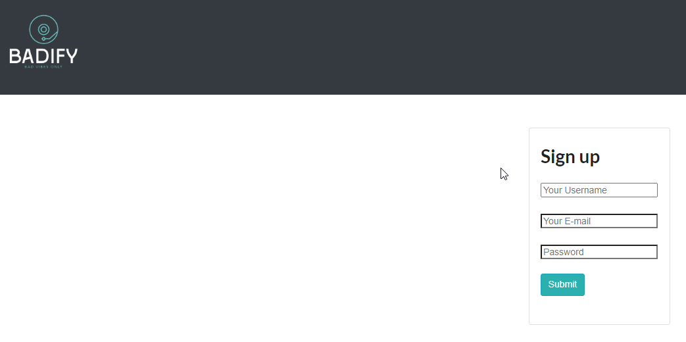
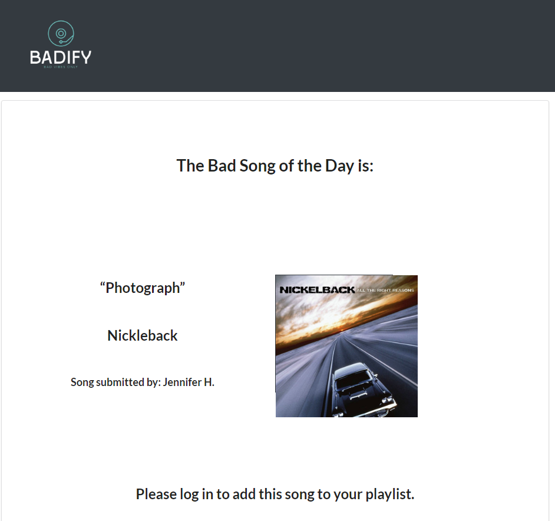
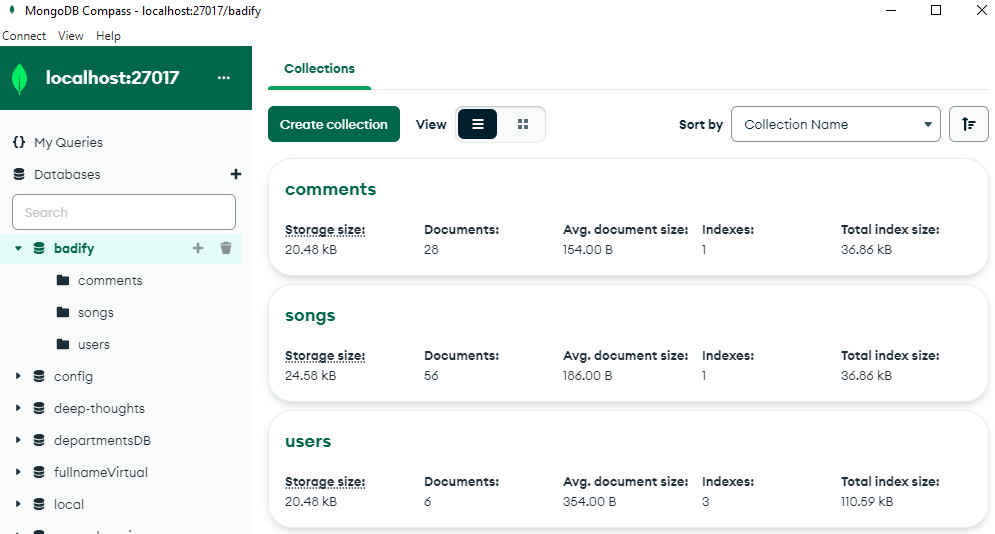

# Badify


## License


## Table of Contents

- [Description](#description)
- [User Story](#user-story)
- [Technologies Used](#technologies-used)
- [Acceptance Criteria](#acceptance-criteria)
- [Mock Up](#mock-up)
- [Deployed URL Link](#deployed-url-link)
- [GitHub Repository Link](#github-repository-link)
- [License](#license)
- [Credits](#credits)

## Description

A web application built using the MERN stack that provides users with a different terrible song every day. Registered users can engage with the site by logging in to add comments which are stored in MongoDB and displayed along with each track. To develop an even deeper hatered for music, users can add songs to their own custom playlist and revisit and playback the worst songs whenever they like.

## User Story

```
AS A PERSON who HATES music
I WANT TO FIND and browse lists of the WORST SONGS of all time
SO THAT I can share with my friends and torture them.
I ALSO want to be able to ADD suggested songs
AND create my own custom lists of songs.
WHEN I LOG IN, I want to be able to create my own custom playlists
AND comment on other users playlists. Possibly even upvoting 
and down voting suggested bad songs.
I WANT to be able to click links to bad songs and hear them on
YOUTUBE and/or SPOTIFY

```

## Technologies Used

```
* Mongo DB
* Express
* React
* Node.js
* GraphQL
* Mongoose ODM
* Heroku / AtlasDB
```


## Acceptance Criteria

```

Our group worked to create a real-world full-stack application that provides secure login using JWT and stores user entered info in a backend Mongo Database hosted at Heroku and running AtlasDB. Our project fulfils the following requirements:

* Use Node.js and Express.js to create a GraphQL API.

* Use JSX and React as the template engine.

* Use MongoDB and the Mongoose ODM for the database.

* Use Queries and Mutations for all CRUD.

* Polished UI that is responsive and mobile friendy.

* Provide user authentication (using JWT - JSON Web Token ).

* Protect API keys and sensitive information with environment variables.

* Be deployed using Heroku (with data).

* Be interactive (i.e., accept and respond to user input).

* Meet good-quality coding standards (file structure, naming conventions, follows best practices for class/id naming conventions, indentation, quality comments, etc.).

* Have a professional README (with unique name, description, technologies used, screenshot, and link to deployed application).


```

## Mock-Up

* Sign Up Page



* Bad Song of the Day (Home)



* Mongo Data Model



## License
This application is utilizing the following License: MIT

## Deployed URL Link

[Badify](https://badify.herokuapp.com/)

## GitHub Repository Link

[Nwsheats/BADIFY](https://github.com/Nwsheats/BADIFY)

## Credits
```
Nathan Sheats
Melisa Zahirovic
Ben Wolf
Moony Xiong
Conor Donnelly
```
